# **Library Management API CRUD Operations**
Created a Library Management API performing all CRUD operations. Using golang as a programming language and [gorilla-mux](https://github.com/gorilla/mux) as golang-web framework. Using sql as a database, sql-workbench as visual tool for database and [GORM](https://gorm.io/docs/index.html) as Object Relational Mapping (ORM) library. Used [Postman](https://www.postman.com/) to design, build and test API's crud operations.

 

## **1. Add a new book**

- ## *a) In-Postman*
  

- ## *b) Sql-workbench*
  

## **2. Get book with book-id**

- ## *a) In-Postman*
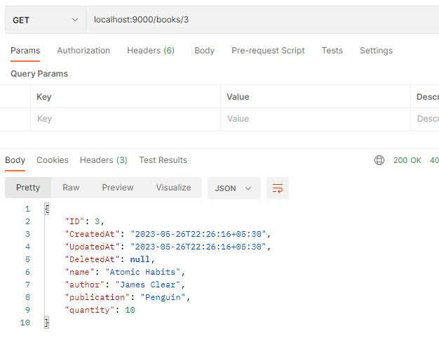  
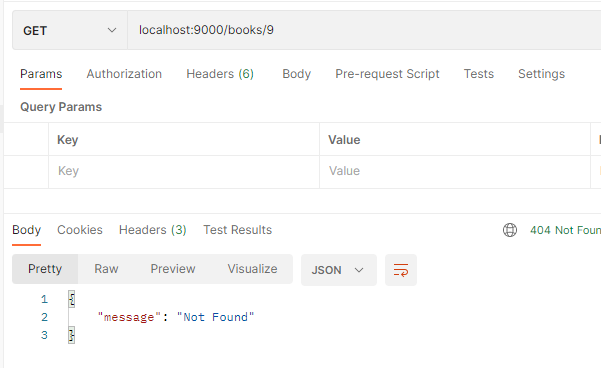

## **3. Update book with book-id**

- ## *a) In-Postman*
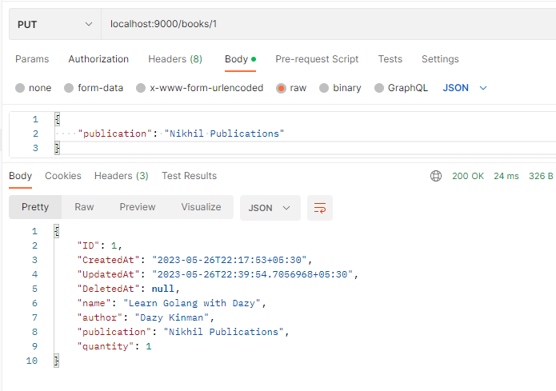

- ## *b) Sql-workbench*
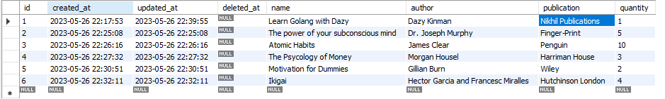

## **4. Get all books**

- ## *a) In-Postman*
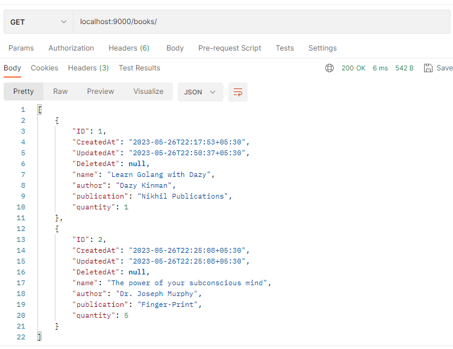

- ## *b) Sql-workbench*
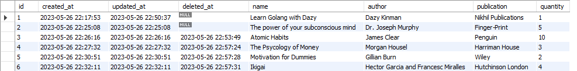

## **5. Delete book**

- ## *a) In-Postman*
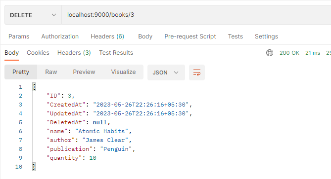  
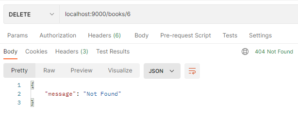

- ## *b) Sql-workbench*
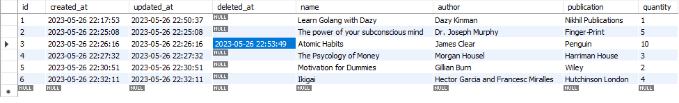

## **6. Check-out Book**

- ## *a) In-Postman*
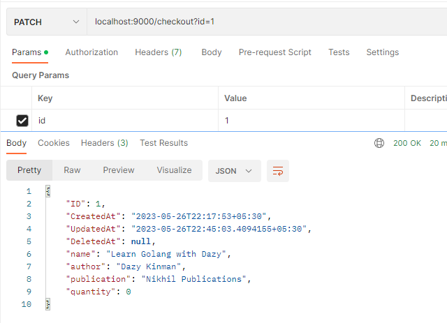  
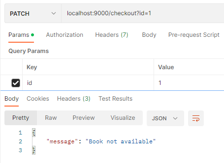

- ## *b) Sql-workbench*
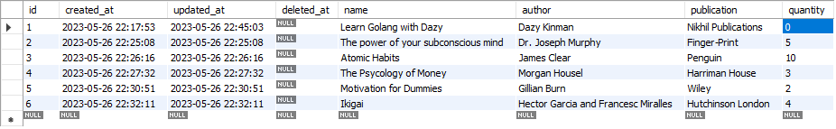

## **7. Check-in Book**

- ## *a) In-Postman*
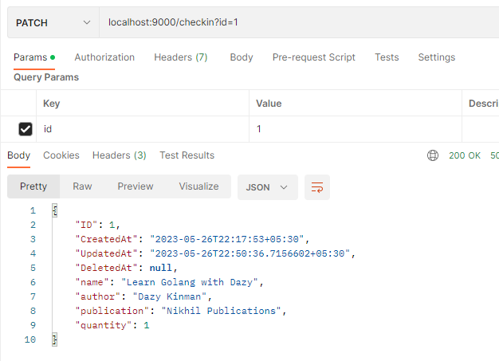

- ## *b) Sql-workbench*
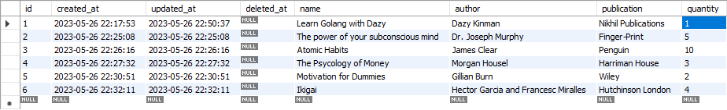

